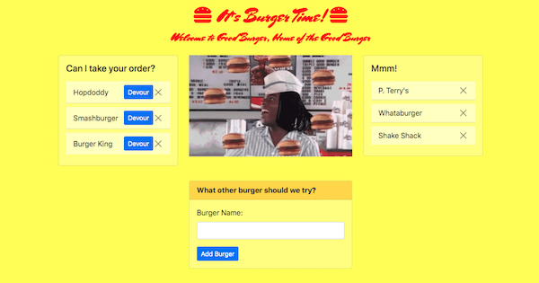

[](https://github.com/maphaiyarath/burger-bar)
# Burger (Handle)Bar(s)



You can demo the app [here](https://maphaiyarath-burger-bar.herokuapp.com/).

## Table of Contents
* [Description](#description)
* [Installation](#installation)
* [Usage](#usage)
* [Credits](#credits)
* [License](#license)
* [Contributing](#contributing)

## Description
Welcome to Burger (Node/Express/Handle)Bar(s), Home of the (Good) Burger, Can I Take Your Order?

This is a burger logger app made with MySQL, Node, Express, Handlebars, and a homemade ORM (yum!).
Users can add burger places they'd like to try and subsequently, try them. Sorry, this isn't DoorDash.

## Installation
Use the following command for installation:
```bash
npm install
```

To get into your MySQL console and create the database with `schema.sql` and populate it with `seeds.sql`, you can run the following:
```bash
mysql -u root -p
source ./db/schema.sql
source ./db/seeds.sql
exit
```

## Usage
The application will be invoked by running:
```bash
node server.js
```

## Credits
* [Express.js](http://expressjs.com/)
* [Express Handlebars](https://www.npmjs.com/package/express-handlebars)
* [mysql](https://www.npmjs.com/package/mysql)

## License
This project is licensed under the MIT license.

## Contributing
n/a